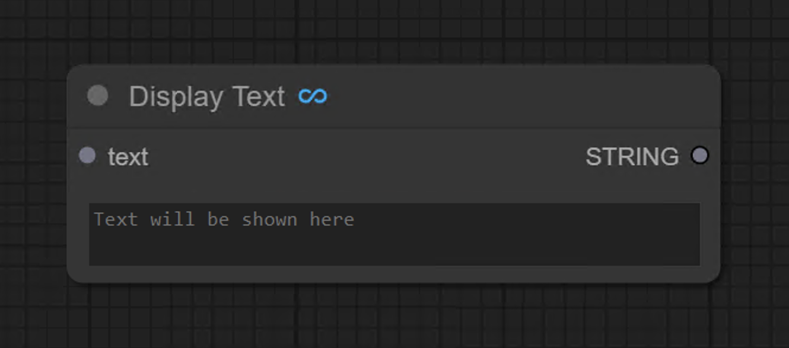

# ComfyUI CodeDeveloper Custom Nodes Pack

**ComfyUI-CodeDeveloper-Nodes** is an extension pack designed to enhance the usability of [ComfyUI](https://github.com/comfyanonymous/ComfyUI). It offers various custom nodes for ComfyUI that can help with code based workflows.

## Installation
To install ComfyUI-CodeDeveloper-Nodes in addition to an existing installation of ComfyUI, you can follow the following steps:

1. goto `ComfyUI/custom_nodes` dir in terminal(cmd)
2. `git clone https://github.com/AndyWilliams0n/ComfyUI-CodeDeveloper-Nodes.git`
3. Restart ComfyUI

## Nodes

### Display Text Node

This is a node to display a text string

Inputs: STRING
Outputs: STRING

## Roadmap

- [x] Node: Show text with passthrough.
- [ ] Node: Show text with functions (append) with passthrough.

# Disclaimer

* This extension simply provides the convenience of installing custom nodes and does not guarantee their proper functioning.

## Credit
ComfyUI/[ComfyUI](https://github.com/comfyanonymous/ComfyUI) - A powerful and modular stable diffusion GUI.

**And, for all ComfyUI custom node developers**
